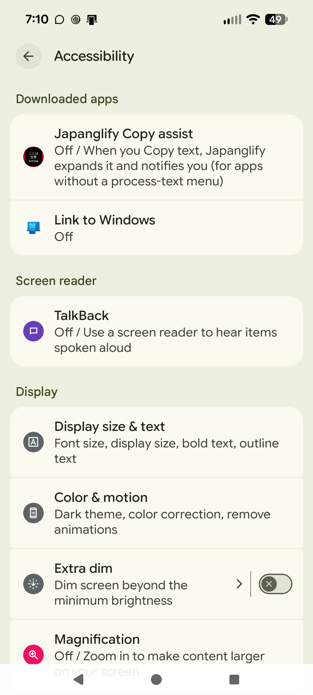
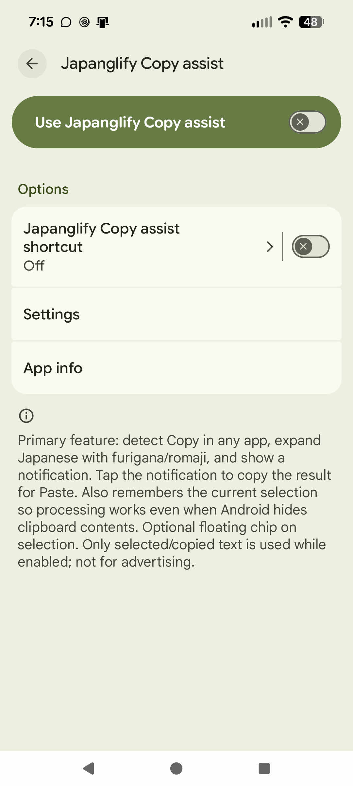
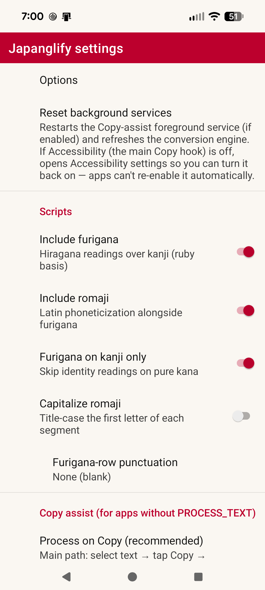

# Japanglify

Android app that adds a **global text-selection menu item**. Selecting Japanese text and tapping **Japanglify** expands the selection in place (or copies it when the host is read-only) with:

1. **Base text** — the original selection  
2. **Furigana** — hiragana readings (ruby basis; kanji via Kuromoji/IPADIC)  
3. **Romaji** — Latin phoneticization with a configurable system and position  

No prompts on the menu action. All options live on a separate settings screen (app launcher icon).

## Download

Not on the Play Store — install the APK directly from the latest GitHub Release:

**[⬇ Download app-release.apk](https://github.com/brianreborn/japanglify/releases/latest/download/app-release.apk)** (signed, recommended)

A debug build is also available on the [Releases page](https://github.com/brianreborn/japanglify/releases/latest) for development/testing.

Since this isn't a Play Store install, Android will warn about installing from an unknown source the first time — that's expected; allow it for this APK.

## Features

| Area | Details |
|------|---------|
| System menu | `ACTION_PROCESS_TEXT` — appears in the floating text toolbar system-wide |
| Furigana | Hiragana readings; kanji-only by default |
| Romaji systems | Modified Hepburn, Traditional Hepburn, Kunrei-shiki, Nihon-shiki, Wāpuro |
| Romaji position | Below (default, max visibility), above, after, before |
| Output formats | Interlinear (default), furigana inline (《》), parenthetical, HTML double-sided ruby, compact brackets |
| Orientation | Horizontal default; vertical (tategaki) experimental hook for future UI |
| Offline | Kuromoji dictionary bundled; no network required — except the optional English-translation line below, off by default |
| Build hosts | Linux, macOS, Windows, **FreeBSD** (Linuxulator + Linux SDK) |

### Triple-script conventions

- **HTML ruby**: W3C double-sided ruby — `<rt>` furigana, `<rtc>` romaji (`ruby-position: under` by default).  
- **Parenthetical plain text**: `漢字（かんじ / kanji）` — common when ruby is unavailable.  
- **Interlinear**: three aligned lines (furigana / base / romaji) for maximum legibility.  
- **Vertical**: settings flag + HTML `writing-mode: vertical-rl` path; plain-text hosts get a marked approximation until a dedicated vertical view lands.

## Project layout

```
domain/          # pure Kotlin JVM — romanizer, analyzer, renderer (no Android)
app/             # Android shell: PROCESS_TEXT + settings + Kuromoji
scripts/         # SDK bootstrap, FreeBSD Linuxulator prep, brandelf
```

See [ARCHITECTURE.md](ARCHITECTURE.md) for how the pieces fit together
(the two independent entry points into the conversion engine, the
clipboard/accessibility assist pipeline, and the build setup).

## Build without the Android SDK (domain)

The core conversion pipeline is a pure JVM module. You only need **JDK 17+** (21 recommended) and the Gradle wrapper — **no Android SDK, no Android Studio**.

```bash
cd Projects/Japanglify
./scripts/verify-domain.sh
# or:
./gradlew :domain:test :domain:runDemo
```

Demo (optional custom text, kana works offline without Kuromoji):

```bash
./gradlew :domain:runDemo -PdemoText=こんにちは
```

## Build the Android APK

Requires:

- JDK 17+ (run Gradle with 17 or 21)
- Android SDK platform **35** + build-tools **35**
- A supported host: **Linux, macOS, Windows, or FreeBSD**

### Option A — you already have an SDK

```bash
echo "sdk.dir=$HOME/Android/Sdk" > local.properties
./gradlew :app:assembleDebug
adb install -r app/build/outputs/apk/debug/app-debug.apk
```

### Option B — bootstrap a minimal SDK (no Android Studio)

```bash
./scripts/bootstrap-android-sdk.sh   # downloads cmdline-tools into ./sdk
./gradlew :app:assembleDebug
```

### FreeBSD build host (Linuxulator)

Google ships Android SDK / AGP natives for Linux, not FreeBSD. This project treats FreeBSD as a first-class **build host** by:

1. Spoofing `os.name=Linux` for the Android Gradle Plugin so it pulls **Linux** aapt2/build-tools.
2. Installing the **Linux** command-line SDK under `./sdk` (or `$ANDROID_SDK_ROOT`).
3. Running **`brandelf -t Linux`** on newly downloaded Linux ELFs so the FreeBSD Linuxulator executes them.
4. Hooking Gradle task **`brandLinuxElfs`** so branding runs before `preBuild` / resource processing.

#### One-time host setup

```bash
# As root — load Linuxulator and install a Linux userland
sysrc linux_enable=YES
service linux start          # loads linux.ko / linux64.ko
pkg install linux_base-rl9   # provides /compat/linux (glibc, ld-linux)
# brandelf(1) ships with FreeBSD base
```

#### Build on FreeBSD

```bash
cd Projects/Japanglify
# Prefer OpenJDK 17/21 for Gradle (not a bleeding-edge default JDK)
export JAVA_HOME=/usr/local/openjdk21
export PATH="$JAVA_HOME/bin:$PATH"

./scripts/bootstrap-android-sdk.sh   # Linux SDK + brandelf
./scripts/assemble-debug.sh          # re-brands + :app:assembleDebug
# or:
./gradlew :app:assembleDebug         # auto-runs :brandLinuxElfs
```

`sdkmanager` and AGP are told `os.name=Linux` via `JAVA_TOOL_OPTIONS` so they offer/download the **Linux** package set (`platform-tools`, `build-tools`, aapt2). Fresh Linux ELFs are marked with `brandelf -t Linux` so the kernel Linuxulator runs them (verified: `aapt2 version`, `adb version`, and a full `:app:assembleDebug` producing `app/build/outputs/apk/debug/app-debug.apk`).

If AGP downloads a fresh aapt2 into `~/.gradle/caches` mid-build and a native tool fails with “Exec format error”, re-brand and retry:

```bash
./scripts/prepare-freebsd-build.sh
./gradlew :app:assembleDebug
```

| Script | Role |
|--------|------|
| `scripts/lib/freebsd-linuxulator.sh` | Detect FreeBSD + Linuxulator readiness |
| `scripts/lib/brand-linux-elfs.sh` | Recursive `brandelf -t Linux` for Linux ELFs |
| `scripts/bootstrap-android-sdk.sh` | Download Linux SDK; brand after unpack |
| `scripts/prepare-freebsd-build.sh` | Brand SDK + Gradle cache natives |
| `scripts/assemble-debug.sh` | Prep + assembleDebug in one shot |

Skip the Android app module (domain only): `./gradlew -PincludeApp=false :domain:test`.

## Usage

1. Install the APK and open **Japanglify** once (settings / options).  
2. In any app, select Japanese text.  
3. Tap **Japanglify** in the selection toolbar (check the **⋮ overflow** if it is not among the first icons — Android only shows a few `PROCESS_TEXT` actions inline).  
4. Editable fields are replaced; read-only selections are copied to the clipboard.

### If Japanglify does not appear in the selection menu

| Cause | What to do |
|-------|------------|
| Overflow | Open ⋮ / “…” on the floating toolbar — custom actions often live there |
| Host app (e.g. **Twitter/X**) | Custom menus never call `PROCESS_TEXT` — use **Clipboard assist** instead |
| MIME type | App registers `text/plain` **and** `text/*` |
| Not installed / disabled | Reinstall APK; check Settings → Apps that Japanglify is enabled |

### Copy hook (primary path for X)

X never lists third-party items in Cut/Copy/Paste. Japanglify’s **main** path is:

1. Japanglify → enable **Process on Copy** → allow notifications.  
2. **Accessibility settings** → enable **Japanglify Copy assist** (status must be On).  
3. In X: select text → tap **Copy**.  
4. Auto Japanglify (uses remembered selection and/or clipboard with retries).  
5. Result notification → **tap to copy** → **Paste**.  

Optional: floating chip on selection is secondary. FGS clipboard watch is a weak fallback.

Enabling step 2, in Android Settings → Accessibility → Downloaded apps:



Tap through to the detail screen and flip **Use Japanglify Copy assist** on:



(The list also shows a stock Android "shortcut" toggle — that's an OS-level quick-toggle gesture common to every accessibility service, not something Japanglify adds; it isn't part of the setup above.)

### Settings (separate screen only)



- Include furigana / romaji  
- Furigana on kanji only  
- Romanization system (Hepburn variants, Kunrei, Nihon, Wāpuro)  
- Romaji position (default: **below** for maximum visibility)  
- Output format (interlinear default; furigana inline / parenthetical / HTML ruby / compact)  
- Writing orientation (horizontal / experimental vertical)
- Include English translation (off by default — requires network; the only feature that does)

## Example outputs

Interlinear (default, romaji below):

```
 にほんご      べんきょう
  日本語   を   勉強     する
nihongo o benkyou suru
```

Furigana inline (Aozora-style, best for Discord/chat):

```
日本語《にほんご》を勉強《べんきょう》する
nihongo o benkyou suru
```

Parenthetical:

```
日本語（にほんご / nihongo）を（o）勉強（べんきょう / benkyou）する（suru）
```

HTML double-sided ruby (paste into HTML-capable hosts):

```html
<ruby><rb>日本語</rb><rt>にほんご</rt><rtc style="ruby-position:under">nihongo</rtc></ruby>
```

## License

App code is licensed under the [BSD 3-Clause License](LICENSE).

Bundled/downloaded third-party data and libraries keep their own upstream
licenses — see [ARCHITECTURE.md](ARCHITECTURE.md) and the in-app About →
Credits screen for the full list (Kuromoji/IPADIC: Apache License 2.0;
JMdict/EDICT: CC BY-SA 4.0; Unicode CLDR: Unicode-3.0; Princeton WordNet:
WordNet License).
