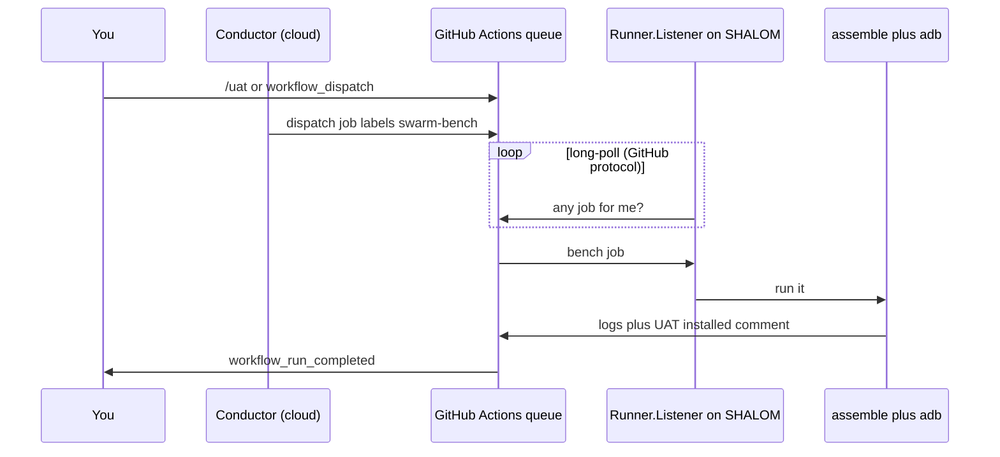

# GitHub is the event bus (do not poll Grok)

GitHub already long-polls and webhooks. Do not 2-minute busy-wait in a Grok chat.

The bench does **not** poll the conductor. The conductor does **not** poll SHALOM. Mailbox is GitHub.

| Event | Native mechanism |
|---|---|
| Job available for SHALOM | `Runner.Listener` long-polls Actions (this **is** the backend poll) |
| Bench finished | same workflow `report` job (`needs: bench`) |
| Owner notice | Grok automation `japanglify-uat-complete` on `workflow_run_completed` |
| `/kick` | Actions `swarm-kick.yml` (mailbox). Watch script only starts a **dead** listener |
| Queued > 20 min | Watchdog `swarm-watchdog.yml` every 10 min posts `swarm-uat-queued` once |

`workflow_run_completed` never fires while a job is **queued**. That means the listener is down — `/kick` + `swarm-kick-watch.ps1`, not a Grok poll.
